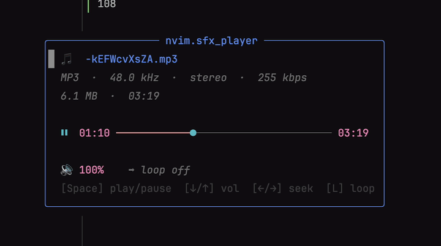

# nvim.sfx_player

[](https://discord.gg/a2qzfrFzWT)



A tiny audio player popup for Neovim. Open an `mp3`, `wav`, `flac`, `ogg`, … file
straight from your file explorer (e.g. [nvim-tree](https://github.com/nvim-tree/nvim-tree.lua))
and get a floating window with file info and a **live, colored timeline** you drive
from the keyboard.

```
╭───────────────── nvim.sfx_player ─────────────────╮
│  🎵  impact_piano_falls.mp3                       │
│  MP3  ·  44.1 kHz  ·  stereo  ·  320 kbps         │
│  1.8 MB  ·  00:47                                 │
│                                                   │
│  ⏸  00:12 ━━━━━━━━━●───────────────────── 00:47   │
│                                                   │
│  🔊 100%    🔁 loop off                           │
│  [Space] play/pause  [↓/↑] vol  [←/→] seek …      │
╰───────────────────────────────────────────────────╯
```

Playback is handled by [`mpv`](https://mpv.io/) over its JSON IPC socket, so
play/pause, seek and volume are real-time and gapless — no process restarts.

## Features

- Floating popup with track metadata (codec, sample rate, channels, bitrate, size, duration)
- Live, **colored** progress bar that follows your colorscheme
- Play / pause, seek ±Ns, volume up/down, loop toggle
- Fully configurable: title, keymaps, colors, default volume, seek step, refresh rate, …
- One-line integration with nvim-tree (or call `open()` from anywhere)
- No orphan processes: `mpv` is always cleaned up when the popup closes

## Requirements

- Neovim ≥ 0.9
- [`mpv`](https://mpv.io/) — required (playback backend)
- [`ffprobe`](https://ffmpeg.org/) — optional, adds codec/sample-rate/bitrate metadata

### macOS

```sh
brew install mpv        # required
brew install ffmpeg     # optional, provides ffprobe
```

### Linux

```sh
# Debian / Ubuntu
sudo apt install mpv ffmpeg

# Fedora
sudo dnf install mpv ffmpeg

# Arch
sudo pacman -S mpv ffmpeg
```

> `ffmpeg` provides `ffprobe`. Without it the player still works — it just shows
> less metadata and relies on `mpv` for the duration.

## Installation

### lazy.nvim

```lua
{
  "monok-robeto/nvim.sfx_player",
  event = "VeryLazy",
  opts = {}, -- same as calling require("nvim.sfx_player").setup{}
}
```

### packer.nvim

```lua
use({
  "monok-robeto/nvim.sfx_player",
  config = function()
    require("nvim.sfx_player").setup()
  end,
})
```

### Local checkout (git submodule / dev)

```lua
{
  "monok-robeto/nvim.sfx_player",
  dir = vim.fn.stdpath("config") .. "/libs/nvim.sfx_player",
  lazy = false,
  config = function()
    require("nvim.sfx_player").setup()
  end,
}
```

## Usage

### From nvim-tree

Wire it into your nvim-tree `on_attach`. `nvimtree_attach` makes `<CR>` and
`<Tab>` open the player for audio files and keeps the default action for
everything else:

```lua
require("nvim-tree").setup({
  on_attach = function(bufnr)
    local api = require("nvim-tree.api")
    api.config.mappings.default_on_attach(bufnr)          -- keep defaults
    require("nvim.sfx_player").nvimtree_attach(bufnr)      -- add audio handling
  end,
})
```

You can override which keys are used:

```lua
require("nvim.sfx_player").nvimtree_attach(bufnr, { open = "o", preview = "<Tab>" })
```

### Commands

| Command                 | Description                        |
| ----------------------- | ---------------------------------- |
| `:SfxPlayerOpen {file}` | Play a file (with path completion) |
| `:SfxPlayerClose`       | Close the popup and stop playback  |

### Lua API

```lua
local sfx = require("nvim.sfx_player")
sfx.open("/path/to/track.flac")  -- open the popup for a file
sfx.close()                      -- close it
sfx.is_audio("/path/to/x.mp3")   -- => true/false, by configured extensions
```

## Controls (inside the popup)

| Key           | Action           |
| ------------- | ---------------- |
| `<Space>`     | play / pause     |
| `<Right>`     | seek forward 3s  |
| `<Left>`      | seek backward 3s |
| `<Up>`        | volume up        |
| `<Down>`      | volume down      |
| `L`           | toggle loop      |
| `<Esc>` / `q` | quit             |

All of these are configurable (see below).

## Configuration

Call `setup{}` with any subset of the options below. Defaults are shown.

```lua
require("nvim.sfx_player").setup({
  title = "nvim.sfx_player",   -- popup title

  mpv_path = "mpv",            -- change if not on $PATH
  ffprobe_path = "ffprobe",    -- optional metadata source

  default_volume = 100,        -- 0-130 (mpv soft volume)
  volume_step = 5,             -- % per key press
  seek_step = 3,               -- seconds per seek
  loop_default = false,        -- start with loop enabled

  update_interval = 200,       -- timeline refresh in ms
  bar_width = 34,              -- progress bar width in cells
  border = "rounded",          -- any nvim_open_win border
  auto_close_on_leave = true,  -- close popup when it loses focus

  window = {
    width = nil,               -- default: bar_width + 20
    row = nil,                 -- default: vertically centered
    col = nil,                 -- default: horizontally centered
  },

  icons = {
    file = "🎵",
    paused = "▶",              -- shown while paused
    playing = "⏸",             -- shown while playing
    volume = "🔊",
    loop_on = "🔁",
    loop_off = "➡",
  },

  extensions = {               -- treated as audio (lower-case, no dot)
    "mp3", "wav", "flac", "ogg", "oga", "opus", "m4a",
    "aac", "wma", "aiff", "aif", "alac", "ape", "mka",
  },

  -- Each value is a string, a list of strings, or false to disable.
  keymaps = {
    play_pause    = "<Space>",
    seek_forward  = "<Right>",
    seek_backward = "<Left>",
    volume_up     = "<Up>",
    volume_down   = "<Down>",
    toggle_loop   = "L",        -- Shift+L
    quit          = { "<Esc>", "q" },
  },

  -- Passed straight to nvim_set_hl(). Use { link = "Group" } to follow your
  -- theme, or explicit attrs like { fg = "#7aa2f7", bold = true }.
  -- Re-applied automatically on every :colorscheme change.
  highlights = {
    title         = { link = "Title" },
    name          = { link = "Title" },
    meta          = { link = "Comment" },
    icon          = { link = "Special" },
    filled        = { link = "Statement" }, -- played part of the bar
    knob          = { link = "Special" },   -- playhead
    remain        = { link = "Comment" },   -- unplayed part of the bar
    time          = { link = "Number" },
    volume        = { link = "Number" },
    loop_active   = { link = "String" },
    loop_inactive = { link = "Comment" },
    help          = { link = "NonText" },
  },
})
```

### Examples

Custom colors for the timeline:

```lua
require("nvim.sfx_player").setup({
  highlights = {
    filled = { fg = "#a6e3a1", bold = true },
    knob   = { fg = "#f9e2af" },
    remain = { fg = "#45475a" },
  },
})
```

Vim-style seek keys and a bigger seek step:

```lua
require("nvim.sfx_player").setup({
  seek_step = 5,
  keymaps = {
    seek_forward  = "l",
    seek_backward = "h",
    volume_up     = "k",
    volume_down   = "j",
  },
})
```

## How it works

`open()` launches a headless `mpv` (`--no-video --keep-open`) with a unique
`--input-ipc-server` socket, then connects to it with a Neovim pipe channel. A
timer polls `time-pos` / `duration` / `pause` / `volume` and repaints the popup;
key actions send `cycle pause`, `seek`, `add volume`, and `set loop-file`
commands back over the socket. Closing the popup sends `quit` and stops the job,
so nothing is left running.

## License

[MIT](./LICENSE) © monok-robeto
