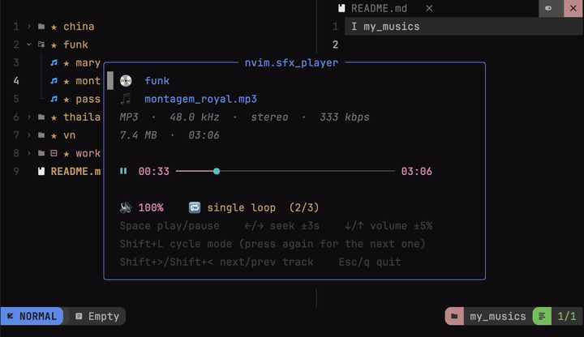

# nvim.sfx_player
[](https://discord.gg/a2qzfrFzWT)

|preview| 
| ----------------------- |
|  

## Overview

I originally created this repository to solve a simple problem: I had too many audio files to audit and didn't want to leave my terminal to listen to them. After using it for a while, both my friends and I realized it was a convenient way to listen to music as well.

Streaming services like YouTube or Spotify often consume significant system resources. While there are existing terminal-based audio players, I found their steep learning curves and complex interfaces quite discouraging. Since Neovim users are already comfortable with file navigation and buffer management, I decided to evolve this project into a full-featured music player plugin.

It simplifies the workflow by treating your existing file system as your music library. You can manage albums and tracks simply by organizing them into folders. When you select a file, the plugin automatically detects the parent directory as an album, allowing you to manage playback across that collection with ease.

A tiny audio player popup for Neovim. Open an `mp3`, `wav`, `flac`, `ogg`, or other audio file straight from your file explorer (such as [nvim-tree](https://github.com/nvim-tree/nvim-tree.lua)) to get a floating window with file information and a live, colored timeline you drive from the keyboard.

Playback is handled by [`mpv`](https://mpv.io/) over its JSON IPC socket. This ensures that play, pause, seek, and volume adjustments are real-time and gapless, with no need for process restarts.

## Key Features

*   **Floating Popup**: Displays track metadata including codec, sample rate, channels, bitrate, file size, and duration.
*   **Live Visuals**: Includes a colored progress bar that automatically adapts to your current Neovim colorscheme.
*   **Playback Control**: Supports play, pause, seeking, and volume adjustment.
*   **Album/Playlist Awareness**: Opening a file scans its folder for sibling audio files. You can cycle through them using four modes: single file loop, sequential, shuffle, or playlist loop. Manual track skipping is also supported.
*   **Highly Configurable**: Customize the title, keymaps, colors, default volume, seek step, refresh rate, and more.
*   **Seamless Integration**: Offers one-line integration with `nvim-tree`, or you can call `open()` from anywhere in your configuration.
*   **Process Management**: No orphan processes are left behind, as the `mpv` instance is cleaned up automatically when the popup closes.

## Requirements

- Neovim ≥ 0.9
- [`mpv`](https://mpv.io/), required (playback backend)
- [`ffprobe`](https://ffmpeg.org/), optional, adds codec/sample-rate/bitrate metadata

### macOS

```sh
brew install mpv        # required
brew install ffmpeg     # optional, provides ffprobe
```

### Linux

```sh
# Debian / Ubuntu
sudo apt install mpv ffmpeg

# Fedora
sudo dnf install mpv ffmpeg

# Arch
sudo pacman -S mpv ffmpeg
```

> `ffmpeg` provides `ffprobe`. Without it the player still works, it just shows
> less metadata and relies on `mpv` for the duration.

## Installation

### lazy.nvim

```lua
{
  "monok-robeto/nvim.sfx_player",
  event = "VeryLazy",
  opts = {}, -- same as calling require("nvim.sfx_player").setup{}
}
```

### packer.nvim

```lua
use({
  "monok-robeto/nvim.sfx_player",
  config = function()
    require("nvim.sfx_player").setup()
  end,
})
```

### Local checkout (git submodule / dev)

```lua
{
  "monok-robeto/nvim.sfx_player",
  dir = vim.fn.stdpath("config") .. "/libs/nvim.sfx_player",
  lazy = false,
  config = function()
    require("nvim.sfx_player").setup()
  end,
}
```

## Usage

### From nvim-tree

Wire it into your nvim-tree `on_attach`. `nvimtree_attach` makes `<CR>` and `<Tab>` open the player for audio files and keeps the default action for everything else:

```lua
require("nvim-tree").setup({
  on_attach = function(bufnr)
    local api = require("nvim-tree.api")
    api.config.mappings.default_on_attach(bufnr)          -- keep defaults
    require("nvim.sfx_player").nvimtree_attach(bufnr)      -- add audio handling
  end,
})
```

You can override which keys are used:

```lua
require("nvim.sfx_player").nvimtree_attach(bufnr, { open = "o", preview = "<Tab>" })
```

### Commands

| Command                 | Description                        |
| ----------------------- | ---------------------------------- |
| `:SfxPlayerOpen {file}` | Play a file (with path completion) |
| `:SfxPlayerClose`       | Close the popup and stop playback  |

### Lua API

```lua
local sfx = require("nvim.sfx_player")
sfx.open("/path/to/track.flac")  -- open the popup for a file
sfx.close()                      -- close it
sfx.is_audio("/path/to/x.mp3")   -- => true/false, by configured extensions
```

## Controls (inside the popup)

| Key             | Action                                            |
| --------------- | -------------------------------------------------- |
| `<Space>`       | play / pause                                       |
| `<Right>`       | seek forward 3s                                    |
| `<Left>`        | seek backward 3s                                   |
| `<Up>`          | volume up                                          |
| `<Down>`        | volume down                                        |
| `Shift+L` (`L`) | cycle playback mode, press again for the next one  |
| `Shift+>` (`>`) | next track in the folder                           |
| `Shift+<` (`<`) | previous track in the folder                       |
| `<Esc>` / `q`   | quit                                                |

The popup itself spells all of this out at the bottom, key + what it does,
so you never have to come back to this table to remember a shortcut. All of
these are configurable (see below).

## Albums / playlists

Opening a file also scans its folder for other files with a configured
audio extension, sorted by name, that's your "album". When it finds more
than one, the popup gains an album line (💿 + folder name) up top so you
know you're not just playing a lone file. `L` cycles through four playback
modes:

| Mode                      | Behaviour                                              |
| ------------------------- | ------------------------------------------------------- |
| single loop (default)     | repeats the current file forever                        |
| sequential                | plays the folder in order, stops after the last file     |
| shuffle                   | plays the folder in random order, stops once each file has played once |
| playlist loop             | plays the folder in order and loops back to the first file |

`>` / `<` skip to the next/previous track manually in any mode (in shuffle
mode they follow the shuffled order). Track changes reuse the running `mpv`
process, so switching songs is gapless, no popup flicker or reconnect.
Set the starting mode with `mode_default` (see Configuration below).

## Configuration

Call `setup{}` with any subset of the options below. Defaults are shown.

```lua
require("nvim.sfx_player").setup({
  title = "nvim.sfx_player",   -- popup title

  mpv_path = "mpv",            -- change if not on $PATH
  ffprobe_path = "ffprobe",    -- optional metadata source

  default_volume = 100,        -- 0-130 (mpv soft volume)
  volume_step = 5,             -- % per key press
  seek_step = 3,               -- seconds per seek

  -- Starting playback mode, see "Albums / playlists" above.
  -- "single" | "sequential" | "shuffle" | "repeat"
  mode_default = "single",

  update_interval = 200,       -- timeline refresh in ms
  bar_width = 34,              -- progress bar width in cells
  border = "rounded",          -- any nvim_open_win border
  auto_close_on_leave = true,  -- close popup when it loses focus

  window = {
    width = nil,               -- default: bar_width + 20
    row = nil,                 -- default: vertically centered
    col = nil,                 -- default: horizontally centered
  },

  icons = {
    file = "🎵",
    album = "💿",              -- album line, only shown when >1 file was found
    paused = "▶",              -- shown while paused
    playing = "⏸",             -- shown while playing
    volume = "🔊",
    mode_single = "🔂",
    mode_sequential = "➡",
    mode_shuffle = "🔀",
    mode_repeat = "🔁",
  },

  extensions = {               -- treated as audio (lower-case, no dot)
    "mp3", "wav", "flac", "ogg", "oga", "opus", "m4a",
    "aac", "wma", "aiff", "aif", "alac", "ape", "mka",
  },

  -- Each value is a string, a list of strings, or false to disable.
  keymaps = {
    play_pause    = "<Space>",
    seek_forward  = "<Right>",
    seek_backward = "<Left>",
    volume_up     = "<Up>",
    volume_down   = "<Down>",
    cycle_mode    = "L",        -- Shift+L
    next_track    = ">",
    prev_track    = "<",
    quit          = { "<Esc>", "q" },
  },

  -- Passed straight to nvim_set_hl(). Use { link = "Group" } to follow your
  -- theme, or explicit attrs like { fg = "#7aa2f7", bold = true }.
  -- Re-applied automatically on every :colorscheme change.
  highlights = {
    title  = { link = "Title" },
    album  = { link = "Directory" }, -- album line, only shown when >1 file was found
    name   = { link = "Title" },
    meta   = { link = "Comment" },
    icon   = { link = "Special" },
    filled = { link = "Statement" }, -- played part of the bar
    knob   = { link = "Special" },   -- playhead
    remain = { link = "Comment" },   -- unplayed part of the bar
    time   = { link = "Number" },
    volume = { link = "Number" },
    mode   = { link = "String" },    -- playback mode + playlist position
    help   = { link = "NonText" },
  },
})
```

### Examples

Custom colors for the timeline:

```lua
require("nvim.sfx_player").setup({
  highlights = {
    filled = { fg = "#a6e3a1", bold = true },
    knob   = { fg = "#f9e2af" },
    remain = { fg = "#45475a" },
  },
})
```

Vim-style seek keys and a bigger seek step:

```lua
require("nvim.sfx_player").setup({
  seek_step = 5,
  keymaps = {
    seek_forward  = "l",
    seek_backward = "h",
    volume_up     = "k",
    volume_down   = "j",
  },
})
```

## How it works

- `open()` scans the target file's folder for sibling audio files (sorted by
  name) to build the album/playlist, then launches a headless `mpv`
  (`--no-video --keep-open`) with a unique `--input-ipc-server` socket and
  connects to it with a Neovim pipe channel.
- A timer polls `time-pos` / `duration` / `pause` / `volume` (and, when in a
  multi-file playback mode, `eof-reached`) and repaints the popup.
- Key actions send `cycle pause`, `seek`, `add volume`, and `set loop-file`
  commands back over the socket. Switching tracks (manually or on
  auto-advance) sends `loadfile ... replace` on the same `mpv` process, so
  it's gapless, no restart. Closing the popup sends `quit` and stops the
  job, so nothing is left running.

## License

[MIT](./LICENSE) © monok-robeto
